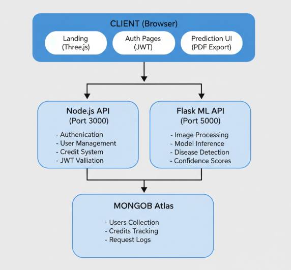
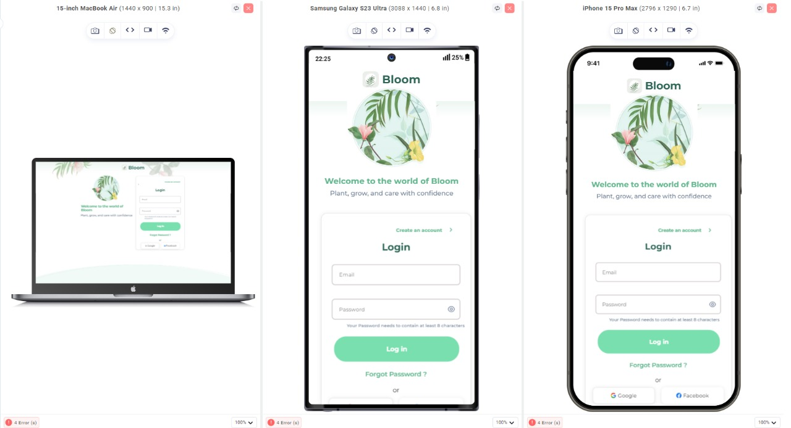
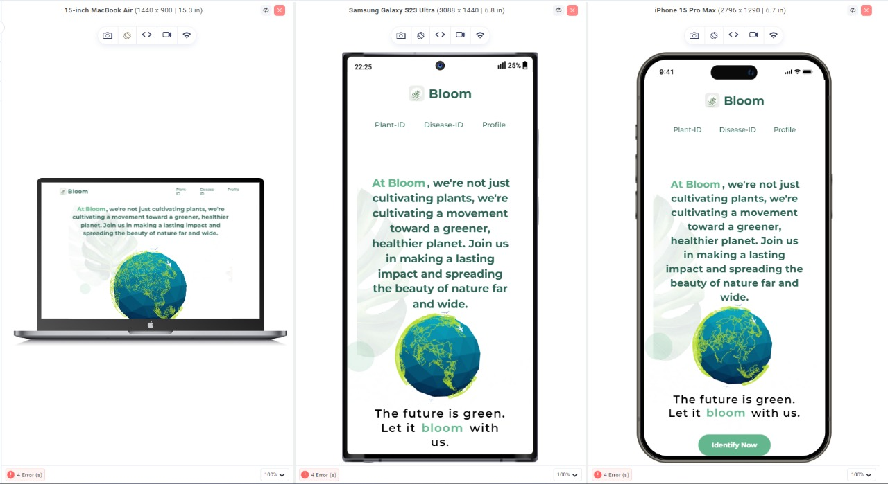
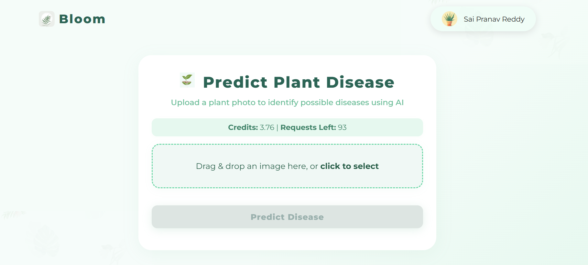

# 🌿 BLOOM - Plant Disease Detection System

### *One Stop for All Plant Cures*

**An intelligent AI-powered web application for detecting plant diseases with 97% accuracy using deep learning.**

[Live Demo](https://bloom--plant-disease-detector.vercel.app/) || [Model Training Repo](YOUR_TRAINING_REPO_LINK_HERE)

---

## 📋 Table of Contents

- [Overview](#overview)
- [Key Features](#key-features)
- [Model Performance](#model-performance)
- [Tech Stack](#tech-stack)
- [Architecture](#architecture)
- [Screenshots](#screenshots)
- [Contributing](#contributing)
- [License](#license)
- [Contact](#contact)

---

## 🌟 Overview

**Bloom** is a full-stack web application that leverages deep learning to detect plant diseases from leaf images. With support for **38 different plant disease classes** across 14 crop species, Bloom helps farmers, gardeners, and agricultural professionals quickly identify plant health issues and receive treatment recommendations.

### 🎯 Problem Statement

Plant diseases cause significant crop losses worldwide. Early detection is crucial for effective treatment, but expert diagnosis is not always accessible. Bloom democratizes plant disease detection using AI.

### 💡 Solution

A user-friendly web platform that:
- Analyzes plant leaf images in real-time
- Provides instant disease diagnosis with confidence scores
- Offers treatment recommendations
- Generates downloadable PDF reports
- Implements a credit-based system for sustainable usage

---

## ✨ Key Features

### 🔍 **Disease Detection**
- **38 Disease Classes**: Covers major crops including Tomato, Potato, Apple, Corn, Grape, and more
- **Real-time Predictions**: Get results in under 3 seconds
- **Confidence Scoring**: Know how certain the AI is about its diagnosis
- **High Accuracy**: 97% accuracy with TensorFlow implementation

### 🎨 **User Experience**
- **Beautiful UI**: Modern, responsive design with smooth animations
- **Drag & Drop Upload**: Easy image upload interface
- **Toast Notifications**: Non-intrusive result display
- **PDF Reports**: Professional downloadable reports with branding
- **Interactive 3D Globe**: Three.js-powered landing page visualization

### 🔐 **Authentication & Security**
- **JWT Authentication**: Secure user sessions
- **Password Hashing**: bcrypt-based password security
- **Protected Routes**: Middleware-based access control
- **CORS Configuration**: Secure cross-origin requests

### 💳 **Credit System**
- **Initial Credits**: 4.0 credits on signup (100 predictions)
- **Fair Usage**: 0.04 credits per prediction
- **Real-time Balance**: Live credit tracking
- **Deduction Logging**: Complete audit trail

### 📊 **Technical Features**
- **RESTful API**: Clean, documented endpoints
- **Microservices Architecture**: Separate ML and auth services
- **Database Integration**: MongoDB for user management
- **Image Preprocessing**: Optimized 128x128 input pipeline
- **Model Optimization**: Efficient inference with TensorFlow

---

## 🎯 Model Performance

### Deep Learning Models

| Model Type | Framework | Accuracy | Training Details |
|------------|-----------|----------|------------------|
| **CNN (TensorFlow/Keras)** | TensorFlow 2.15 | **97%** | Pre-trained on ImageNet, fine-tuned on PlantVillage dataset |
| **Custom Neural Network** | NumPy (from scratch) | **92%** | Built custom backpropagation and gradient descent algorithms |

### Model Architecture (TensorFlow)
Input (128x128x3)
↓
Conv2D + ReLU + MaxPool (×3 blocks)
↓
Flatten + Dense (512) + Dropout(0.5)
↓
Dense (256) + Dropout(0.3)
↓
Output (38 classes) + Softmax

### Dataset
- **Source**: PlantVillage Dataset
- **Images**: 87,000+ labeled images
- **Classes**: 38 disease categories
- **Split**: 70% train, 20% validation, 10% test

**📚 [View Model Training Code](YOUR_TRAINING_REPO_LINK_HERE)**

---

## 🛠️ Tech Stack

### **Frontend**
- **HTML5/CSS3**: Semantic markup and modern styling
- **JavaScript (ES6+)**: Vanilla JS for performance
- **Three.js**: 3D globe visualization
- **jsPDF**: Client-side PDF generation

### **Backend**

#### **Node.js API** (Authentication & Credits)
- **Express.js**: Web framework
- **MongoDB + Mongoose**: Database and ODM
- **JWT**: Token-based authentication
- **bcryptjs**: Password hashing

#### **Flask API** (Machine Learning)
- **Flask**: Lightweight API framework
- **TensorFlow/Keras**: Deep learning inference
- **Pillow**: Image preprocessing
- **NumPy**: Numerical computations
- **Gunicorn**: Production WSGI server

### **Deployment**
- **Frontend**: Vercel (CDN + Edge Network)
- **Node.js API**: Render (Serverless)
- **Flask API**: Render (Container)
- **Database**: MongoDB Atlas (Cloud)

---

## 🏗️ Pipeline

---

## 📸 Screenshots

### Landing Page

### Authentication

### Main Page

### Disease Prediction

### PDF Report

---

## 🤝 Contributing

Contributions are welcome! Please follow these steps:

1. **Fork the repository**
2. **Create a feature branch** 
3. **Commit changes**
4. **Push to branch** 
5. **Open a Pull Request**

### Development Guidelines
- Follow existing code style
- Add tests for new features
- Update documentation
- Ensure all tests pass

---

## 📝 License

This project is licensed under the **MIT License** - see the [LICENSE](LICENSE) file for details.

---

## 👨‍💻 Author

**Yerrabandla Sai Pranav Reddy**

- GitHub: [YSaiPranavReddy](https://github.com/YSaiPranavReddy)
- LinkedIn: [Your Profile](https://linkedin.com/in/your-profile)
- Email: saipranavreddyy09@gmail.com

---

## 🙏 Acknowledgments

- **PlantVillage Dataset**: Training data source
- **TensorFlow Team**: Deep learning framework
- **Open Source Community**: Various libraries and tools
- **MongoDB Atlas**: Database hosting
- **Vercel & Render & Huggingface**: Deployment platforms

---

## 📊 Project Stats

- **Development Time**: 2+ months
- **Supported Plants**: 14 species
- **Disease Classes**: 38 categories
- **Model Accuracy**: 97%
- **API Response Time**: < 7 seconds

---

### ⭐ Star this repository if you find it helpful!

**Made with Code and Heart**

[Report Bug](https://github.com/YOUR_USERNAME/bloom-plant-disease/issues) · [Request Feature](https://github.com/YOUR_USERNAME/bloom-plant-disease/issues)

